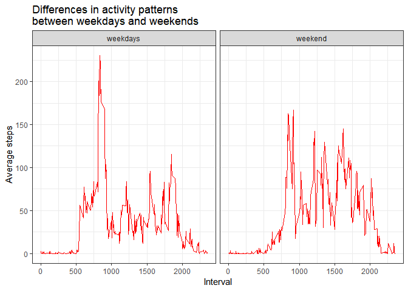
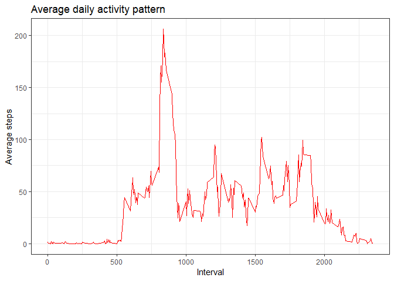
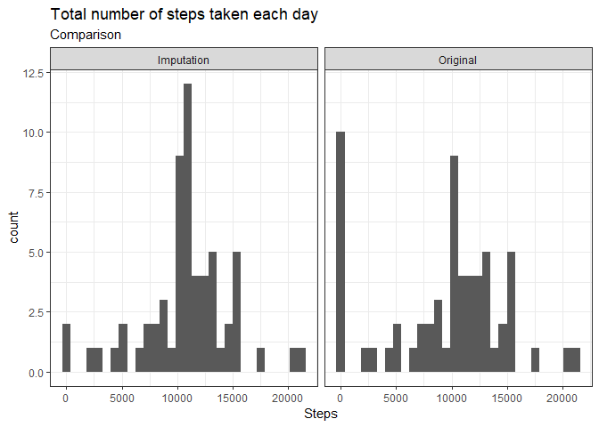
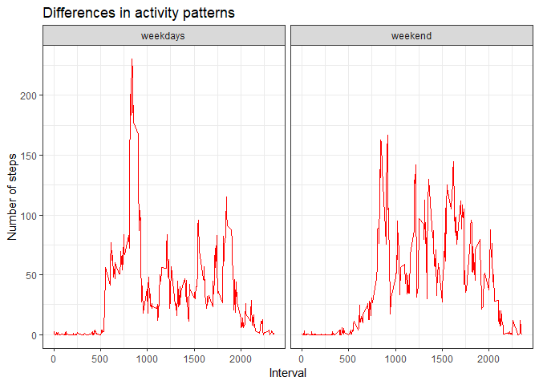

## Loading and preprocessing the data

First, I load the dataset from the zip file. 

```r
library(readr)
```


```r
data <- read_csv("activity.zip")
```

```
## Parsed with column specification:
## cols(
##   steps = col_double(),
##   date = col_date(format = ""),
##   interval = col_double()
## )
```

In this step I don't do anything with data. I think that the preprocessing isn't important right now. 

Second, I would like to know how look elements of this dataset to get to know something about them. It's why I use these functions - in my opinion knowledge of data is an important element in the data analysis.


```r
head(data)
```

```
## # A tibble: 6 x 3
##   steps date       interval
##   <dbl> <date>        <dbl>
## 1    NA 2012-10-01        0
## 2    NA 2012-10-01        5
## 3    NA 2012-10-01       10
## 4    NA 2012-10-01       15
## 5    NA 2012-10-01       20
## 6    NA 2012-10-01       25
```

```r
dim(data)
```

```
## [1] 17568     3
```

```r
summary(data)
```

```
##      steps             date               interval     
##  Min.   :  0.00   Min.   :2012-10-01   Min.   :   0.0  
##  1st Qu.:  0.00   1st Qu.:2012-10-16   1st Qu.: 588.8  
##  Median :  0.00   Median :2012-10-31   Median :1177.5  
##  Mean   : 37.38   Mean   :2012-10-31   Mean   :1177.5  
##  3rd Qu.: 12.00   3rd Qu.:2012-11-15   3rd Qu.:1766.2  
##  Max.   :806.00   Max.   :2012-11-30   Max.   :2355.0  
##  NA's   :2304
```

```r
str(data)
```

```
## Classes 'spec_tbl_df', 'tbl_df', 'tbl' and 'data.frame':	17568 obs. of  3 variables:
##  $ steps   : num  NA NA NA NA NA NA NA NA NA NA ...
##  $ date    : Date, format: "2012-10-01" "2012-10-01" ...
##  $ interval: num  0 5 10 15 20 25 30 35 40 45 ...
##  - attr(*, "spec")=
##   .. cols(
##   ..   steps = col_double(),
##   ..   date = col_date(format = ""),
##   ..   interval = col_double()
##   .. )
```

## What is mean total number of steps taken per day?

First of all I prepare dataset with sum of steps per day. I add the index Name equal to `Original` because later it help me with comparing the imputation and original dataset.


```r
library(dplyr)
```


```r
sum_perday <- data %>%
  group_by(date) %>%
  summarise(sum_perday = sum(steps, na.rm = TRUE)) %>%
  mutate(Name = "Original")    
```


After this step I visualize the histogram of total number of steps taken each day.

```r
library(ggplot2)
```


```r
ggplot(data = sum_perday) +
        geom_histogram(mapping = aes(x = sum_perday)) +
        labs(x = "Steps", title = "Total number of steps taken each day") +
        theme_bw()
```

```
## `stat_bin()` using `bins = 30`. Pick better value with `binwidth`.
```

<!-- -->
It seems that the most common value is zero, but we know abour many NA values in this dataset and probably it's why this values are so common. Next very often values is abotu 10 000 steps so in my opinion owner of this device has to be an active person. 


```r
stat_steps <- summarize(sum_perday, 
        mean_perday = round(mean(sum_perday, na.rm = TRUE), 2),
        median_perday = median(sum_perday, na.rm = TRUE)) %>%
        mutate(Name = "Original")

print(stat_steps)
```

```
## # A tibble: 1 x 3
##   mean_perday median_perday Name    
##         <dbl>         <dbl> <chr>   
## 1       9354.         10395 Original
```
Answer: Mean total number of steps taken per day is equal to 9354.23, 1.0395\times 10^{4}, Original.

## What is the average daily activity pattern?

Below I prepare the data to find some specific pattern of daily activity.

```r
daily_activity <- data %>% 
  group_by(interval) %>%
  summarise(mean_steps = mean(steps, na.rm = TRUE))
```


Also I create time series visualization to show this average pattern. 

```r
ggplot(data = daily_activity, mapping = aes(x = interval, y = mean_steps)) +
  geom_line(colour = "red") +
  labs(x = "Interval", y = "Average steps", title = "Average daily activity pattern") +
  theme_bw()
```

<!-- -->

In my opinion person who is device owner has to work between 10 a.m. and 6 p.m. Probably this person goes to work by car because about 6 p.m. we can see low activity - may be this person goes to home by car and then relaxes in the couch. Of course we see high activity in the morning which starts about 7 a.m. - im my opinion this person could be a amatour runner.


```r
daily_activity[which.max(daily_activity$mean_steps),]
```

```
## # A tibble: 1 x 2
##   interval mean_steps
##      <dbl>      <dbl>
## 1      835       206.
```
The maximum value of number of steps is on the morning - may be during the morning jogging.

## Imputing missing values

This dataset have a lot of NA rows. My goal is to recognize why this value is so common. Below I show how many this NA value are. 


```r
data_NA <- length(is.na(data$steps))
Percentage_NA <- length(which(is.na(data$steps)))/length(data$steps)

print(list(data_NA, Percentage_NA))
```

```
## [[1]]
## [1] 17568
## 
## [[2]]
## [1] 0.1311475
```

The reason of so many NA values in this dataset is very simple - in that days this device didn't work or was turned off. To manage with NA values I replace them by the average of number of steps in specific interval. In this moment very usefull is the `daily_activity` dataset which I created in the last step.


```r
data_imput <- data %>%
  left_join(., daily_activity, by = c("interval")) %>%
  transform(steps = ifelse(is.na(steps), round(mean_steps, 0), steps)) %>%
  select(-mean_steps)
```


Again I calculate basic statistics of number of steps (median and mean). I show the results in one table to present differences between them.  

```r
sum_perday_imput <- data_imput %>%
  group_by(date) %>%
  summarise(sum_perday = sum(steps)) %>%
  mutate(Name = "Imputation")        
        
stat_steps_imput <- summarize(sum_perday_imput, 
        mean_perday = round(mean(sum_perday), 2),
        median_perday = median(sum_perday)) %>%
        mutate(Name = "Imputation")

print(union(stat_steps, stat_steps_imput))
```

```
## # A tibble: 2 x 3
##   mean_perday median_perday Name      
##         <dbl>         <dbl> <chr>     
## 1      10766.         10762 Imputation
## 2       9354.         10395 Original
```
We see that after imputation the median and the mean increse. It's normal because we replace NA values by the numeric value so I think that this is very intuitive. Moreover a mean value and a median value are similar. The reason of this is very simple - I replace the NA element by the average value of each interval so now a median and a mean have to be very similar.


```r
data_perday <- union(sum_perday, sum_perday_imput) 

ggplot(data = data_perday) +
        geom_histogram(mapping = aes(x = sum_perday)) +
        facet_grid(. ~ Name) +
        labs(x = "Steps") +
        labs(title = "Total number of steps taken each day") +
        labs(subtitle = "Comparison") +
        theme_bw()
```

```
## `stat_bin()` using `bins = 30`. Pick better value with `binwidth`.
```

<!-- -->

Histogram of element is very intuitive - last time we have many NA values.

## Are there differences in activity patterns between weekdays and weekends?
To analyze the differences between weekdays and weekends activity patterns I do some calculation belows.

```r
library(lubridate)
```


```r
data_week <- data_imput %>%
  mutate(wday = wday(date, week_start = getOption("lubridate.week.start", 1)),
         type = ifelse(wday %in% c(6, 7), "weekend", "weekdays"))

summary_week <- data_week %>%
  group_by(interval, type) %>%
  summarise(mean_steps = mean(steps, na.rm = TRUE))
```

The most important thing to show differences is visualization. It show that on weekend this person has more activity during the all day than on weekdays. The next difference is that on the weekend morning this person has lower numer of steps than in weekdays so may be at weekend this person runs rarely.

```r
ggplot(data = summary_week, mapping = aes(x = interval, y = mean_steps)) +
  geom_line(colour = "red") +
  labs(x = "Interval", y = "Number of steps", title = "Differences in activity patterns") +
  facet_grid(. ~ type) +
  theme_bw()
```

<!-- -->


