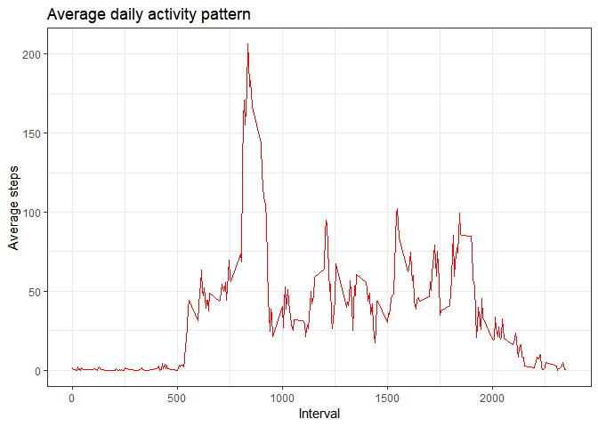

## Loading and preprocessing the data


Firstly I load the dataset from the zip files. 

```r
library(readr)
data <- read_csv("activity.zip")
```

```
## Parsed with column specification:
## cols(
##   steps = col_double(),
##   date = col_date(format = ""),
##   interval = col_double()
## )
```

Secondly I wanted to show some first elements of this dataset to get to know something about them. Of course I used the 'summary' and 'str' function to see some basics statistics.

```r
summary(data)
```

```
##      steps             date               interval     
##  Min.   :  0.00   Min.   :2012-10-01   Min.   :   0.0  
##  1st Qu.:  0.00   1st Qu.:2012-10-16   1st Qu.: 588.8  
##  Median :  0.00   Median :2012-10-31   Median :1177.5  
##  Mean   : 37.38   Mean   :2012-10-31   Mean   :1177.5  
##  3rd Qu.: 12.00   3rd Qu.:2012-11-15   3rd Qu.:1766.2  
##  Max.   :806.00   Max.   :2012-11-30   Max.   :2355.0  
##  NA's   :2304
```

```r
head(data)
```

```
## # A tibble: 6 x 3
##   steps date       interval
##   <dbl> <date>        <dbl>
## 1    NA 2012-10-01        0
## 2    NA 2012-10-01        5
## 3    NA 2012-10-01       10
## 4    NA 2012-10-01       15
## 5    NA 2012-10-01       20
## 6    NA 2012-10-01       25
```

```r
str(data)
```

```
## Classes 'spec_tbl_df', 'tbl_df', 'tbl' and 'data.frame':	17568 obs. of  3 variables:
##  $ steps   : num  NA NA NA NA NA NA NA NA NA NA ...
##  $ date    : Date, format: "2012-10-01" "2012-10-01" ...
##  $ interval: num  0 5 10 15 20 25 30 35 40 45 ...
##  - attr(*, "spec")=
##   .. cols(
##   ..   steps = col_double(),
##   ..   date = col_date(format = ""),
##   ..   interval = col_double()
##   .. )
```

```r
dim(data)
```

```
## [1] 17568     3
```

Now I know that this dataset have a lot of NA rows. My goal is to recognize why this value is so common. Below I show how many this NA value are. 


```r
Percentage_NA <- length(which(is.na(data$steps)))/length(data$steps)
print(Percentage_NA)
```

```
## [1] 0.1311475
```
The reason of so many NA values in this dataset is very simple - in that days this device didn't work or was turned off. 


## What is mean total number of steps taken per day?


```r
library(dplyr)
```

```
## 
## Attaching package: 'dplyr'
```

```
## The following objects are masked from 'package:stats':
## 
##     filter, lag
```

```
## The following objects are masked from 'package:base':
## 
##     intersect, setdiff, setequal, union
```

```r
sum_perday <- data %>%
  group_by(date) %>%
  summarise(sum_perday = sum(steps, na.rm = TRUE))

mean_steps <- summarize(sum_perday, mean_perday = round(mean(sum_perday, na.rm = TRUE), 2))
```
Answer: Mean total number of steps taken per day is equal to 9354.23.

## What is the average daily activity pattern?


```r
library(ggplot2)
```

```
## Registered S3 methods overwritten by 'ggplot2':
##   method         from 
##   [.quosures     rlang
##   c.quosures     rlang
##   print.quosures rlang
```

```r
daily_activity <- data %>% 
  group_by(interval) %>%
  summarise(mean_steps = mean(steps, na.rm = TRUE))

ggplot(data = daily_activity, mapping = aes(x = interval, y = mean_steps)) +
  geom_line(colour = "red") +
  labs(x = "Interval", y = "Average steps", title = "Average daily activity pattern") +
  theme_bw()
```

<!-- -->


## Imputing missing values


```r
data_imput <- data %>%
  left_join(., daily_activity, by = c("interval")) %>%
  transform(steps = ifelse(is.na(steps), round(mean_steps, 0), steps)) %>%
  select(-mean_steps)
```

## Are there differences in activity patterns between weekdays and weekends?


```r
library(lubridate)
```

```
## 
## Attaching package: 'lubridate'
```

```
## The following object is masked from 'package:base':
## 
##     date
```

```r
data_week <- data_imput %>%
  mutate(wday = wday(date, week_start = getOption("lubridate.week.start", 1)),
         type = ifelse(wday %in% c(6, 7), "weekend", "weekdays")) %>%
  group_by(interval, type) %>%
  summarise(mean_steps = mean(steps, na.rm = TRUE))

ggplot(data = data_week, mapping = aes(x = interval, y = mean_steps)) +
  geom_line(colour = "red") +
  labs(x = "Interval", y = "Average steps", title = "Differences in activity patterns \nbetween weekdays and weekends") +
  facet_grid(. ~ type) +
  theme_bw()
```

<!-- -->


